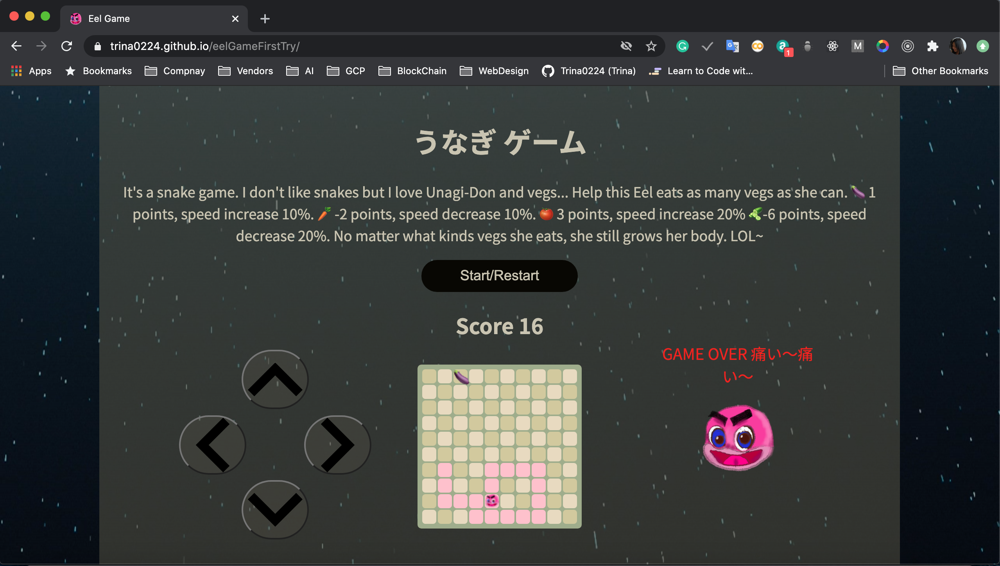

# eelGameFirstTry
It's a frontend website practice using HTML/CSS and JS. A traditional snake-game. Because I wouldn't say I like snakes, I rename it to eel. This repo is an excellent course on Scrimba. Please check the details below.



```diff
@@ It's not a responsive website, I only know it is okay on my Mac, Surface and Sony's Xperia @@
@@ but not on my iPhone and iPad. @@
```
### [CLICK HERE][mylink]

[mylink]:https://trina0224.github.io/eelGameFirstTry/ "my eelgame"


## What I learned
1. Traditional snake-game rules and algorithms.
2. The virtual keypad is important because tablets, cellphones, and touch-screens are almost everywhere. I tried to build my own one, the JS part is simple, but making it styled is challenging. At last, I decided to use __div-btn-img__ stacks up. Using __div__ to keep buttons in places, __img__ is a container to put arrows.
3.  I use __procreate__ to draw my pink eel head. It's also the first time I used this app on my iPad, it's brought me a lot of fun, and I decided to practice it to build a digital-drawing skill.
4.  I am trying to put small *PNG* files to represent eel's head. I cannot find a way to put an image in *div* class. So I reuse the same skill that I  learned in 3. I used __div-img__ cascaded method.
5. __div-img__ this method bring me another trouble, when I used ```(div).textContent= '🍆'``` to show vegetables on the board,  the __img__ tag in __div__ was gone, I work- around this issue via replacing all emoji to small 20x20 pixel .png files.
6. I learned how to put a video for my background. ## Some Numbers  

## MISC
1.  One *div* force everything display in the column. The other div forces everything display in rows.
2.  Each *div* is 20px*20px
3.  Already known bugs/issues:
	* Vegetables may generate on eel's body.
	* The eel cannot walk/pass on herself.
	* The code in CSS and JS are messy.
	* It's not working well on iPad because it generates multi vegetables and eel heads.😭⛈
4.  It's a homework to me. No plan to improve it for now.    

## Reference
1. [Scrimba][scrimbalink], a frontend online training website.
2. Instructor's [github][Ania]. She also shared several different games.  
3. Yellosub's [code][Yellosub-blackbird24]. Her design is beautiful and clean.
4. The 4 arrows are from [here][icons].
5. PNG file of vegetables are downloaded from [Emojipedia.org][emoji]
6. Background video is from [here][bpVideo].
7. Background video related [code][w3Schools].

[scrimbalink]:https://scrimba.com/ "Scrimba"
[Ania]:https://github.com/kubowania?tab=repositories "Instructor"
[Yellosub-blackbird24]:https://jsfiddle.net/blackbird24/pfd1qmhk/ "code"
[icons]:https://www.flaticon.com/ "flaticon"
[emoji]:https://emojipedia.org/ "Emojipedia"
[bpVideo]:https://cdn.videvo.net/videvo_files/videos/FallingStars5Videvo.mov "background video"
[w3Schools]: https://www.w3schools.com/howto/howto_css_fullscreen_video.asp "w3Schools"
